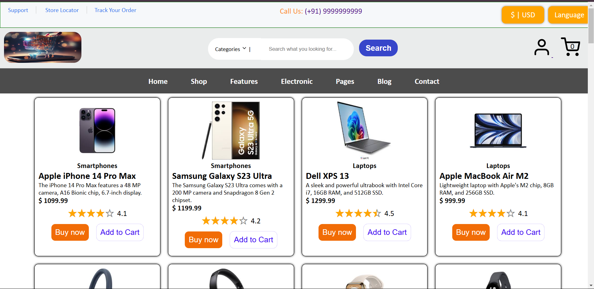
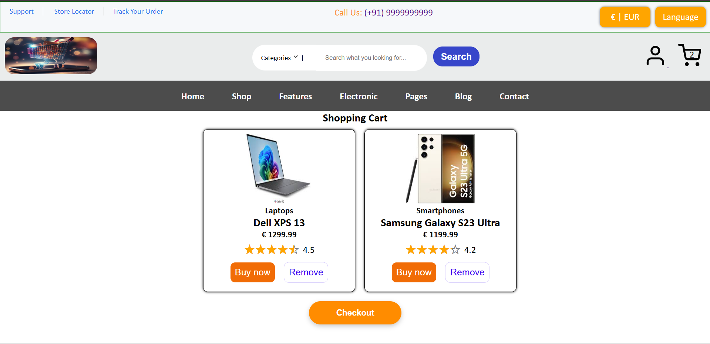

# 🛍️ E-Commerce Shopping Cart Application using React

## 📜 Introduction

Welcome to my **E-Commerce Shopping Cart Application** built using **React**! This is a simple yet functional shopping cart with features like **Add to Cart**, **Responsive Design**, and **Dynamic Cart Updates**. I built this project while learning React on [Coursera](https://www.coursera.org/learn/developing-frontend-apps-with-react).

## 🚀 Features

- **Add to Cart**: Users can add products to their shopping cart.
- **Responsive Design**: The app is designed to be mobile-friendly and responsive across different screen sizes.
- **Dynamic Cart Updates**: The number of items in the cart dynamically updates when products are added or removed.
- **Product Listing**: Products are displayed in cards, and users can view details before adding them to the cart.
- **Redux**: Used for state management across the application.
- **React Router**: Used for managing routing between pages (Product Listing, Cart).

---

## 🛠️ Technologies Used

- **React**: For building the user interface.
- **Redux**: For managing the state of the application.
- **React Router**: For routing between different pages (Product Listing, Cart).
- **CSS**: For styling and layout.

---

## 📸 Screenshot

Here is a preview of the website:





## 📝 Installation Guide

To run this project locally, follow these steps:

### Prerequisites

Before starting, ensure you have **Node.js** and **npm** installed on your machine. You can download and install them from [here](https://nodejs.org/).

### Steps

1. **Clone this repository**:

   ```bash
   git clone https://github.com/ritik88961-sudo/Coursera_Developing_Frontend_App_Using_React_Project.git
   ```

2. **Navigate into the project folder**:

   ```bash
   cd Coursera_Developing_Frontend_App_Using_React_Project
   ```

3. **Install all the dependencies**:

   Run the following command to install the required packages (React, Redux, Router, etc.):

   ```bash
   npm install
   ```

4. **Start the project**:

   Now, run the project locally on your machine:

   ```bash
   npm start
   ```

   This will launch the application at `http://localhost:3000` in your browser.

---

## 💻 Student Information

- **Student**: Ritik Kumar  
- **Course**: Coursera - Developing Frontend Apps using React  
- **Email**: ritik88961@gmail.com  
- **GitHub**: [Ritik Kumar GitHub Profile](https://github.com/ritik88961-sudo)  

---

Enjoy browsing the shopping cart and feel free to reach out if you have any questions! 😊
